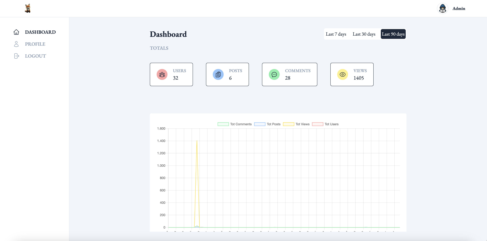

<h1>Blipster</h1>

Blog Management Platform
 

![Lines of code]
![Language]
![Node]
![React]
![Angular]

 

Blipster is a Blog Management Platform to manage and share your blogs.

This project utilizes a variety of modern [technologies](#tech-stack) to build a full-stack web application. I have intentionally chosen a diverse set of tools and frameworks to explore and work across multiple layers of the tech stack.

At high level, the project is composed of 2 single page applications served by a **Node.js** backend:

- a public blog frontend app, built using the **React** framework and rendered on the server (SSR)

  

   

- an admin frontend app, built using the **Angular** framework and rendered on the client (CSR)

  

### 🚀 Functionalities

- Browse blog posts.
- View blog posts details and leave comments.
- Create and manage your blog posts.
- Secure access with JWT authentication.
- View insights on views, engagement, and interactions (only for admin user).

###  🛠 Tech stack

- **Frontend**: React, Angular, Tailwind CSS
- **Backend**: Node.js, Express.js
- **Database**: MongoDB, Mongoose

<!----------------------------------{ Badges }--------------------------------->

[Lines of code]: https://tokei.rs/b1/github/AndrBene/Blipster
[Language]: https://img.shields.io/github/languages/top/AndrBene/Blipster
[node]: https://img.shields.io/badge/dynamic/json?url=https%3A%2F%2Fraw.githubusercontent.com%2FAndrBene%2FBlipster%2Frefs%2Fheads%2Fmaster%2Fpackage.json&query=%24.engines.node&label=node&color=%2300B000
[react]: https://img.shields.io/badge/dynamic/json?url=https%3A%2F%2Fraw.githubusercontent.com%2FAndrBene%2FBlipster%2Frefs%2Fheads%2Fmaster%2Fpackage.json&query=%24.dependencies.react&label=react&color=%2367b1fa
[angular]: https://img.shields.io/badge/dynamic/json?url=https%3A%2F%2Fraw.githubusercontent.com%2FAndrBene%2FBlipster%2Frefs%2Fheads%2Fmaster%2Fpackage.json&query=%24.dependencies.%40angular%2Fcore&label=angular&color=%23dc143c
